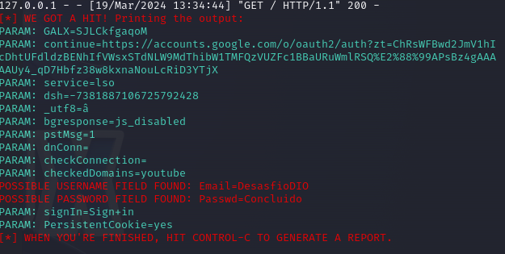
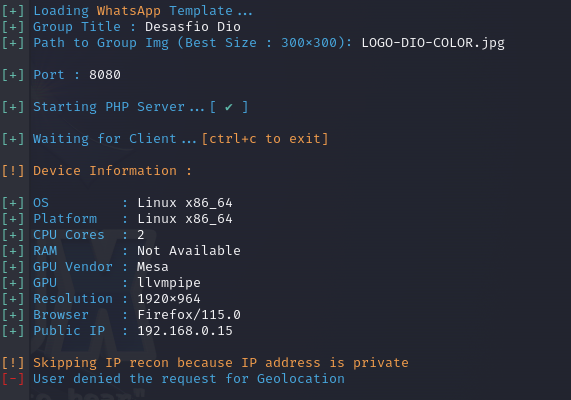

# Phishing para captura de Login e Senhas

### Ferramentas

- Kali Linux
- setoolkit

### Configurando o Phishing no Kali Linux

- Acesso root: ``` sudo su ```
- Iniciando o setoolkit: ``` setoolkit ```
- Tipo de ataque: ``` 1)Social-Engineering Attacks ```
- Vetor de ataque: ``` 2)Web Site Attack Vectors ```
- Método de ataque: ``` 3)Credential Harvester Attack Method ```
- Método de ataque: ``` 1)Web Templates ```
- Método de ataque: ``` 2. Google ```
- Obtendo o endereço da máquina ou acesse localhost: ``` ifconfig ``` ```localhost```

### Resutados




# Phishing para captura de Geolocalização

### Ferramentas

- Kali Linux
- seeker

### Configurando o Phishing no Kali Linux

- Acesse o repositório do github: [seeker](https://github.com/thewhiteh4t/seeker)
- Realize o instalação conforme descrito no repositório
- Acesse a pasta do seeker: ``` cd seeker ```
- Iniciando o seeker: ``` python3 seeker.py ```
- Método de ataque: ``` [2] WhatsApp ```
- Escolha o titulo do grupo.
- Escolha a imagem do grupo.
- Obtendo o endereço da máquina ou acesse localhost: ``` ifconfig ``` ```localhost```

### Resutados




### Para mais eficiência em ambos os ataques:

#### Utilize a Ferramaneta ``` NGROK ```
